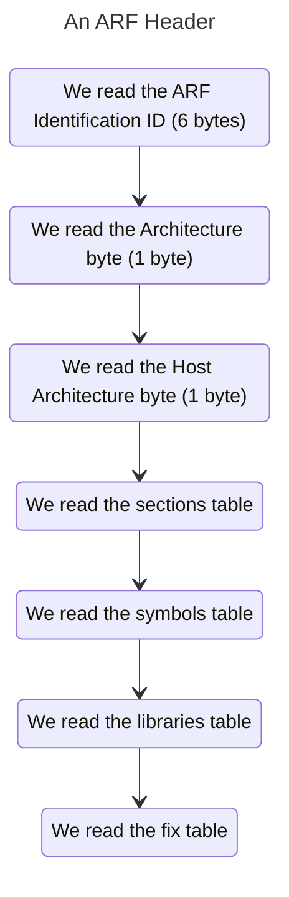

# The Avery Relocatable Format (ARF)
The Avery Relocatable Format is a format for executing relocatable instructions, meaning that it can be loaded in memory in any place, since it does not use any type of hard-coded addresses. It's a successor to ELF in its sense of simplicity and it's tailored for the Avery Kernel.

## Tooling
We offer tooling for dealing with ARF files, although it's a **one way** translation. 
* `arf something.elf` will transform an ELF file to ARF.
* `ald object1.o object2.o object3.o` will link objects into an ARF. (This second one is not implemented but we pretend to do it)

## The Header
The Header tells us about the most important parts of the executable:

Let's dive in each of these points to help you create an ARF header reader.