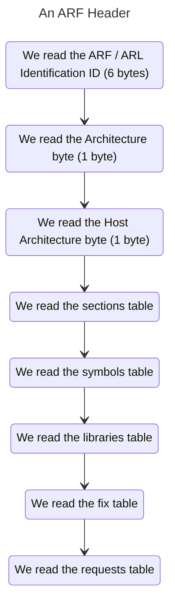

# The Avery Relocatable Format (ARF) 
The Avery Relocatable Format is a format for executing relocatable instructions, meaning that it can be loaded in memory in any place, since it does not use any type of hard-coded addresses. It's a successor to ELF in its sense of simplicity and it's tailored for the Avery Kernel.

## Tooling
We offer tooling for dealing with ARF files, although it's a **one way** translation.<br>
* `arf something.elf -d descriptor.ad` will transform an ELF file to ARF.
* `ald object1.o object2.o object3.o` will link objects into an ARF. (This second one is not implemented but we pretend to do it)

## The Header
The Header tells us about the most important parts of the executable:


Let's dive in each of these points to help you create an ARF header reader.

### The ARF Identification ID
The ARF Identification is the checksum and sanity-check that every header contains. It's usually the name followed by the version of the standard that's using:
```
ARF001
```
The following bytes would correspond to the **ARF format version 0.0.1**

### The ARL Identification ID
The ARL (Avery Relocatable Library) is the same format as ARL, just that to clarify that's a library, we included some different sanity-check signature:
```
ARL001
```
The version number always corresponds to the ARF one. An **ARL 0.0.1 library is the same as an ARF 0.0.1 executable**

### The Architecture Byte
The Archiecture Byte purpose is basically to identify the architecture we're in. This byte should match into:
* The 32-bit (i386 / x86) architecture (`0x1`). **The Avery Kernel for now only supports this one**
* The 64-bit (x86_64) architecture (`0x2`).
* The 32-bit (ARMv7) architecture (`0x3`).
* The 64-bit (ARMv8-A / AArch64) architecture (`0x4`).

More architectures are planned on getting support in the future, like: RISC-V, Power and MIPS

### The Host architecture Byte
The Host architecture Byte is for cross-compilation. It just shows basic information about that. The byte should be the same as the ones on the **Architecture Byte** point. 

## The Sections Table
The Sections Table is the table that indicates the different sections in which the code is splitted, to clarify the different things that this does. Let's have a look.

At the start of the Sections Table, there are four bytes that indicate the **Entry Point** of the program, also called the **Origin**. If the origin is `0x0` then we're looking at a Library. You can follow the same guides for a library, but there won't be a way to execute them.

All Assembly has the addresses hard-coded, thus the origin serves as the parent offset of all of them. Labels in compiled code follow this, so you must load the code at the **address that the entry point has** for it to be safe. Each section can have its own entry offset, and this offset will be **relative to the entry point**.

A section should be read as so:
* **The first byte is the one that indicates that we're talking about a section (`0xFF`)**
* **You should read the name of the section util a `\0` byte is found**
* **Then, read the offset of the section (4 bytes)**
* **Then, read the permissions of the section (1 byte)**<br>
    Permissions are as follows:
    * `0x0` indicates a `READ` value.
    * `0x2` indicates a `WRITE` value.
    * `0x4` indicates a `EXEC` value.
    * `0x10` indicates a `INFO` value.
   
   Values are obtained by OR'ing the following bytes.

Common sections that you'll find in many executables are:
* `code`: Contains the code. It would be `text` in elf
* `data`: Contains initialized global variables with non-zero init values
* `bss`: Contains uninitialized global variables
* `pre`: Contains instructions to be run before the actual execution
* `post`: Contains instructions to be run after the execution
* `note` or `comments`: Contains notes on the compile information and more

But any other sections are totally valid.

## The Symbols Table
The Symbols Table is the table that contains all the symbols in the code, and with them you are able to get information of: where are they, what type are there, and more... Let's see how do you parse it:
* **The first byte says we're talking about a symbol (`0xEE`)**
* **Then it comes the name of the symbol also null-terminated**
* **Then it comes the resolution byte**
  * If the byte is `0x00`, the symbol is resolved completely. The following 4 bytes indicate the offset of the symbol.
  * If the byte is `0x01`, the symbol is not resolved. It should be resolved at linking. Mostly used in `.o` object files.
  * If the byte is `0x02`, the symbol should be merged with other ones that share name with it.
* **The last byte indicates the type of symbol**
  * If the byte is `0x00`, the symbol is a **local** symbol. Should not be shared.
  * If the byte is `0x01`, the symbol is a **global** symbol. It's shared with the rest of files.
  * If the byte is `0x02`, the symbol is a **mixed** symbol. It's like a default implementation but as substitute if there's no present function in the context.
* **The four following bytes indicate the address of the symbol**. Always relative to the offset

## The Libraries Table
The Libraries Table is the table that indicates the different libraries linked to the executable. They can be of different types. Here's how to read them:
* **The first byte says we're talking about a library (`0xDD`)**
* **Then it comes the name of the library, null-terminated**
* **Then it comes the availability byte**
  * If the byte is `0x00`, the library and linked should be **resolved at compile-time**. This is the default
  * Some libraries, specified in the configuration linking file, are resolved at **runtime** by the kernel. This is when the byte is `0xFF`

## The Fix Table
The Fix Table, is a table full of the errors or parts of the code, where the addresses are callibrated wriong, since there's some undefined symbol or something. This table is extensive or not, depending on how many libraries you link.
* **The first byte says we're talking about a fix (`0xCC`)**
* **Then it comes the name of the symbol, null-terminated**
* **Then it comes the address of the address that should be overwritten. The compiler fills some bytes in, but they should be substituted**

## The Requests Table
The Requests Table is a table that says the requests of services that the executable wants from the machine or kernel. These are always resolved at runtime. You can read about them, including their codes [here](kernext.md).
Basically you just read the bytes and do nothing with them until you get to a `0x0` byte. If you want to match the bytes to a name to display information, read the document.

# How to configure the output of an executable
To configure the output of an executable, we can use different tools. One is the `.ad` file extension. Called the **Avery Descriptor**. This format follows a simple pattern. Here's a simple script to put as an example:

```ad
global.entry = 0x10000
global.entryPoint = &start
global.architecture = i386
global.output = executable

global.sections -> {
    code @ 0x10000
    bss @ 0x11000
    otherSection @ 0x12000
}

global.libs -> {
    avery(graphics)
    avery(catamaran)
    ../../other_lib.arl
}

global.kernelExtensions -> {
    framebuffer
    console ; By default, this is incorporated. This is a "fast-loading" extension
    drives
}
```